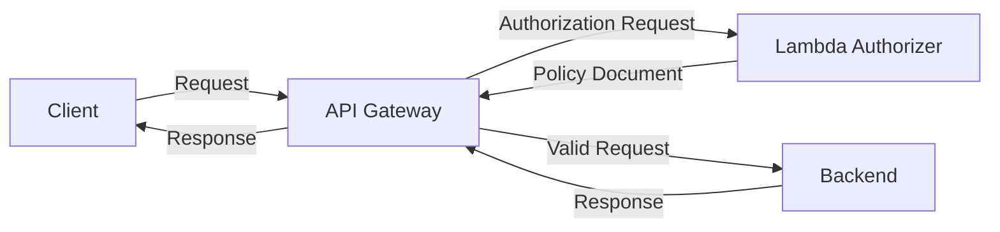

# Terraform SaaS Gateway

```mermaid
graph LR
    A[Client] -->|Request| B[API Gateway]
    B -->|Authorization Request| C[Lambda Authorizer]
    C -->|Policy Document| B
    B -->|Valid Request| D[Backend]
    D -->|Response| B
    B -->|Response| A
```