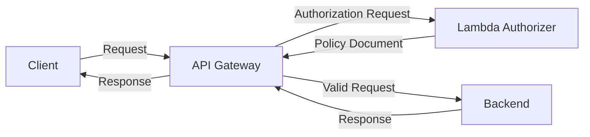

# Terraform SaaS Gateway

A Proof of Concept for the API part of SaaS project.

# Discoveries

## API Gateway type selection

## HTTP API (V2, Introduced in 2019 by AWS)

1. **Purpose:** The HTTP API was introduced to simplify the API Gateway model and to improve the development and deployment experience. It was designed to be simpler and more efficient than the REST API, and supports HTTP/1.1 and HTTP/2 protocols.

2. **Performance and Cost:** HTTP APIs are the winner in terms of performance and cost. They offer a lower cost per million API calls and also have reduced latency compared to REST APIs. This makes them a great option for lightweight, cost-sensitive, or latency-sensitive applications.

3. **Ease of Use:** HTTP APIs were designed to be easier to use with a simplified programming model and improved user interface. They support features such as automatic deployments, CORS configuration, and a default stage and route.

4. **Authentication:** HTTP APIs natively support OpenID Connect and OAuth 2.0, reducing the implementation complexity for these authentication protocols.

5. **Private Integrations:** HTTP APIs support private integrations with AWS services using VPC Link. This includes integration with Application Load Balancers, Network Load Balancers, and AWS Cloud Map.

6. **Limited Features:** HTTP APIs lack support for certain features present in REST APIs, such as AWS X-Ray integration, Canary deployments, and Web Application Firewall (WAF) support.

## REST API (V1, Introduced in 2015 by AWS)

1. **Purpose:** The REST API was the original version of the API Gateway, designed to create, deploy, and manage APIs. It supports a wide array of AWS services and features.

2. **Performance and Cost:** While REST APIs are typically more expensive and have higher latency than HTTP APIs, they are a mature product with a robust feature set.

3. **Rich Features:** REST APIs provide many features that HTTP APIs do not, including canary release deployments, Web Application Firewall (WAF) support, support for AWS X-Ray, and private APIs that only are available within a VPC.

4. **Private Integrations:** REST APIs support private integrations with Network Load Balancers, but the setup process is less straightforward than with HTTP APIs.

5. **OpenAPI Support:** REST APIs support the import of API definitions from OpenAPI, a feature not currently supported by HTTP APIs.